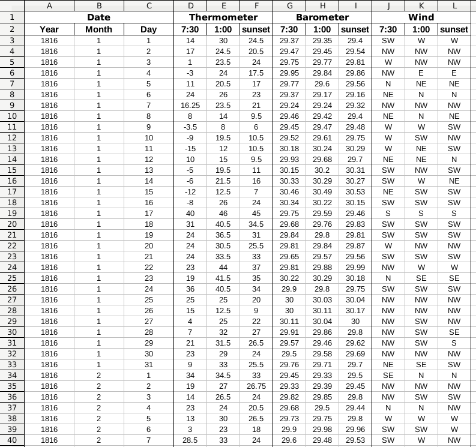
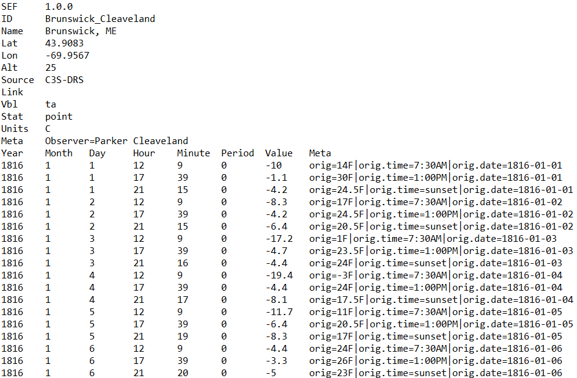

```{r setup, include = FALSE}
knitr::opts_chunk$set(
  collapse = TRUE,
  comment = "#>"
)
```

<br>

<center>
```{r, echo=FALSE, warning=FALSE}

```
</center>

<br>

## Introduction

This page illustrates how to create a SEF file from climate data digitized in an Excel sheet. We will make use of the functions provided within the R package `dataresqc` (version `r packageVersion("dataresqc")`). Other packages are also used (all can be installed with the command `install.packages("packagename")`). The code described in this page can be downloaded [here](https://github.com/C3S-Data-Rescue-Lot1-WP3/SEF/blob/master/docs/example.R).

For instructions on how to install `dataresqc`, see [here](https://github.com/c3s-data-rescue-service/dataresqc/wiki).

To load `dataresqc` from the R command line:
```{r, warning=FALSE}
library(dataresqc)
```
<br>

## Excel file

The Excel file ([example.xls](https://github.com/C3S-Data-Rescue-Lot1-WP3/SEF/blob/master/docs/example.xls?raw=true)) that we want to convert into SEF looks like this:

```{r, echo=FALSE}

```

It contains three daily observations of temperature (in Fahrenheit), pressure (in British inches), and wind direction for Brunswick, ME (coordinates: 43°54'30" N, 69°57'24" W, 25 m asl) for the year 1816 made by Parker Cleaveland.

<br>

## Step 1: Read the Excel file into R

There are many ways to read an Excel file into R. If you are using [RStudio](https://rstudio.com), you can use the graphical interface as described [here](https://support.rstudio.com/hc/en-us/articles/218611977-Importing-Data-with-RStudio). If your version of RStudio is too old, you might need to save the Excel file as `.csv` first.

Another way is to use the R command line directly (this is probably necessary if you are working with many files). There are different packages in R that allows you to read Excel files, for instance `XLConnect`:
```{r, warning=FALSE}
mydata <- XLConnect::readWorksheetFromFile("example.xls", sheet = 1)
```

This will create the variable `mydata`, a data frame that looks like this:
```{r, echo=FALSE}
head(mydata)
```

Note that empty cells are read as `NA` (missing value).

Other packages (such as `readxl`, used by the graphical interface of RStudio) do not produce a data frame; in that case, an additional format conversion is needed:

```{r, warning=FALSE}
mydata <- as.data.frame(mydata)
```

<br>

## Step 2: Prepare the metadata

Metadata are as important as the data themselves. Some metadata are required in SEF files, such as station name, geographical coordinates, units, variable and statistic code.

Coordinates in particular is where mistakes are introduced more often during data manipulation. The most common mistake arises from the conversion from degrees-minutes-seconds to decimal format. SEF files require the coordinates to be in decimal format (and the altitude in meters). We create three variables that contain the coordinates in the correct format:

```{r, warning=FALSE}
latitude <- round(43 + 54/60 + 30/3600, 4)
longitude <- round(-(69 + 57/60 + 24/3600), 4)
altitude <- 25
```

The minus sign is used for the longitude because the station is located west of the Greenwich meridian. Note that the parentheses are important! We also rounded to the fourth decimal place using the function `round`.

The rest of the metadata can be written directly in the argument of the function that will create the SEF file (see below).

<br>

## Step 3: Change data frame structure

Since SEF requires one observation for each line, we need to transform the data frame `mydata` accordingly. Moreover, each SEF files contains only data for one variable, so it might be practical to create one data frame for each variable. Therefore, we will make a list of three data frames (one for each variable) with SEF-like structure. This can be done using the R functions `rep`, `c`, and `t` (repeat, combine, and transpose):

```{r, warning=FALSE}
# Create empty list
sefdata <- list()

# Create data frame for temperature (under name 'ta')
sefdata$ta <- data.frame(Year = rep(mydata$Year, each=3),
                         Month = rep(mydata$Month, each=3),
                         Day = rep(mydata$Day, each=3),
                         Value = c(t(mydata[,4:6])))

# Create data frame for pressure (under name 'p')
sefdata$p <- data.frame(Year = rep(mydata$Year, each=3),
                         Month = rep(mydata$Month, each=3),
                         Day = rep(mydata$Day, each=3),
                         Value = c(t(mydata[,7:9])))

# Create data frame for wind (under name 'dd')
sefdata$dd <- data.frame(Year = rep(mydata$Year, each=3),
                         Month = rep(mydata$Month, each=3),
                         Day = rep(mydata$Day, each=3),
                         Value = c(t(mydata[,10:12])))
```

We chose the names of the list elements so that they represent the variable code. This will turn out useful later.

The new data frames will look like this:
```{r, echo=FALSE}
head(sefdata$ta)
```

<br>

## Step 4: Add time

There are still two columns missing in the new data frames that we just created: hour and minute. Two of the observation times are fixed but the third is at sunset: we need first to estimate the sunset time for each day. The package `suncalc` comes in handy here:

```{r, warning=FALSE}
# First we create a vector of dates
dates <- as.Date(paste(mydata$Year, mydata$Month, mydata$Day, sep="-"))
# Calculate sunset times (in UTC) for each date 
sunsets <- suncalc::getSunlightTimes(dates, latitude, longitude, 
                                     keep="sunset", tz="GMT")$sunset
# Convert from UTC to local time
sunsets <- sunsets + 3600 * longitude * 12 / 180
```

The addition converts the time from UTC to local mean solar time (i.e., the time used by the observer in 1816). The variable `sunsets` is a vector with 366 elements (one for each day of 1816) giving the local time of sunset.

We now need to prepare two vectors with hour and minute, respectively, to add to the data frames with SEF structure. The package `lubridate` facilitates the necessary conversion from time to numeric format:

```{r, warning=FALSE}
# First we put NA for the sunset times
hours <- rep(c(7, 13, NA), times = 366)
minutes <- rep(c(30, 0, NA), times = 366)
# Then we add the sunset times in place of the NAs
hours[is.na(hours)] <- lubridate::hour(sunsets)
minutes[is.na(minutes)] <- lubridate::minute(sunsets)
```

We can then add two new columns for hour and minute to the data frames in the list `sefdata`.  Since the times are identical for all variables, we can use a loop:
```{r, warning=FALSE}
for (v in names(sefdata)) {
  sefdata[[v]]$Hour <- hours
  sefdata[[v]]$Minute <- minutes
  sefdata[[v]] <- sefdata[[v]][, c("Year", "Month", "Day", 
                                   "Hour", "Minute", "Value")]
}
```

The third command puts the columns in the right order (as in a SEF file).

Now the data frame `sefdata$ta` will look like this:
```{r, echo=FALSE}
head(sefdata$ta)
```

<br>

## Step 5: Add Meta column

It is good practice to add the originally digitised values and the original times to the last column of the SEF file. The text in this column must have the form:
```
"orig=original value|orig.time=original time"
```

where the original value includes the original units ("F" for temperature, "in" for pressure, none for wind direction).

Here we can use the R function `paste0` to concatenate strings. We write the strings into a new column `Meta` in the data frames:
```{r, warning=FALSE}
original_units <- c("F", "in", "")
obs_times <- c("7:30AM", "1:00PM", "sunset")
names(original_units) <- names(sefdata)
for (v in names(sefdata)) {
  sefdata[[v]]$Meta <- paste0("orig=", 
                              sefdata[[v]]$Value, 
                              original_units[v], 
                              "|orig.time=", 
                              rep(obs_times, times=366))
}
```


<br>


## Step 6: Convert into metric units

It is recommended to convert the data into metric units. This can be done easily with the following commands:
```{r, warning=FALSE}
# Fahrenheit to Celsius
sefdata$ta$Value <- round((sefdata$ta$Value - 32) * 5 / 9, 1)

# Inches to hPa
sefdata$p$Value <- round(convert_pressure(sefdata$p$Value, 
                                          f = 25.4, 
                                          lat = latitude, 
                                          alt = altitude), 1)
```

Here we also rounded the results to one decimal place.

The function `convert_pressure` (part of the `dataresqc` package) not only performs the conversion to hPa, but also applies a correction for gravity (that is why latitude and altitude are given in the argument) and temperature (however, in this case we do not have the attached temperature of the barometer that would be required for this correction). The argument `f` gives the conversion factor from inches to mmHg.

To be usable, the wind direction must be converted into degrees from the geographical North. For wind directions in English (16 possible directions):
```{r, warning=FALSE}
directions <- c("N", "NNE", "NE", "ENE", "E", "ESE", "SE", "SSE", "S",
                "SSW", "SW", "WSW", "W", "WNW", "NW", "NNW")
sefdata$dd$Value <- 22.5 * (match(toupper(sefdata$dd$Value), directions) - 1)
```

<br>

## Step 7: Write SEF files

We can now use the function `write_sef` of the `dataresqc` package in a loop over the tree variables:
```{r, warning=FALSE}
units <- c("C", "hPa", "degree")
names(units) <- names(sefdata)
for (v in names(sefdata)) {
  write_sef(Data = sefdata[[v]][, 1:6],
            outpath = getwd(),
            variable = v,
            cod = "Brunswick_Cleaveland",
            nam = "Brunswick, ME",
            lat = latitude,
            lon = longitude,
            alt = altitude,
            sou = "C3S-DRS",
            units = units[v],
            stat = "point",
            metaHead = paste0("Observer=Parker Cleaveland", 
                              ifelse(v=="p", "|PTC=N|PGC=Y", "")),
            meta = sefdata[[v]][, 7],
            period = 0,
            time_offset = longitude * 12 / 180)
}
```

For clarity, it is worth going through each parameter of the function:

```{r, eval=FALSE}
Data = sefdata[[v]][, 1:6]
```
means that we use the first 6 columns of the dataframe ``sefdata$v`` (where v is the variable code) to create the data table in the SEF file.

```{r, eval=FALSE}
variable = v
```
means that we use the names of the data frames as variable codes.

```{r, eval=FALSE}
cod = "Brunswick_Cleaveland"
nam = "Brunswick, ME"
```
are the definitions of the station code and name (these are just examples).
```{r, eval=FALSE}
lat = latitude
lon = longitude
alt = 25
```
define the coordinates.

```{r, eval=FALSE}
sou = "C3S-DRS"
```
a name of the source/dataset/project that can facilitate the identification of the data provider.

```{r, eval=FALSE}
units = units[v]
```
the metric units in which the data are provided (the vector `units` is defined just before the loop)

```{r, eval=FALSE}
stat = "point"
```
the statistic code: "point" means that these are instantaneous observations. Other possible values are "mean", "maximum", "minimum", "mid_range" (see SEF documentation).

```{r, eval=FALSE}
metaHead = paste0("Observer=Parker Cleaveland", 
                  ifelse(v=="p", "|PTC=N|PGC=Y", ""))
```
here we define the metadata in the last field of the header: we write the observer name and if the variable is pressure we also write that the data have been corrected for gravity (`PGC=Y`) but not for temperature (`PTC=N`).

```{r, eval=FALSE}
meta = sefdata[[v]][, 7]
```
the 7th column of the data frames contains the metadata for each observation (i.e., the values and times as digitized).

```{r, eval=FALSE}
period = 0
```
for instantaneous observations the period code is, by definition, 0 (see SEF documentation).

```{r, eval=FALSE}
time_offset = longitude * 12 / 180
```
this is to convert time to UTC (assuming observations are in mean local solar time), as required in the SEF.

The resulting SEF files should look like this:

```{r, echo=FALSE}

```

<br>

## Step 8: Check SEF files

Finally, to be sure that the files are compatible with SEF standards, we can run the function `check_sef`:
```{r, warning=FALSE}
check_sef("C3S-DRS_Brunswick_Cleaveland_18160101-18161231_ta.tsv")
check_sef("C3S-DRS_Brunswick_Cleaveland_18160101-18161231_p.tsv")
check_sef("C3S-DRS_Brunswick_Cleaveland_18160101-18161231_dd.tsv")
```
